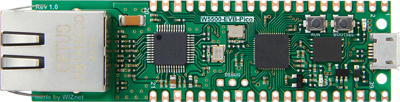
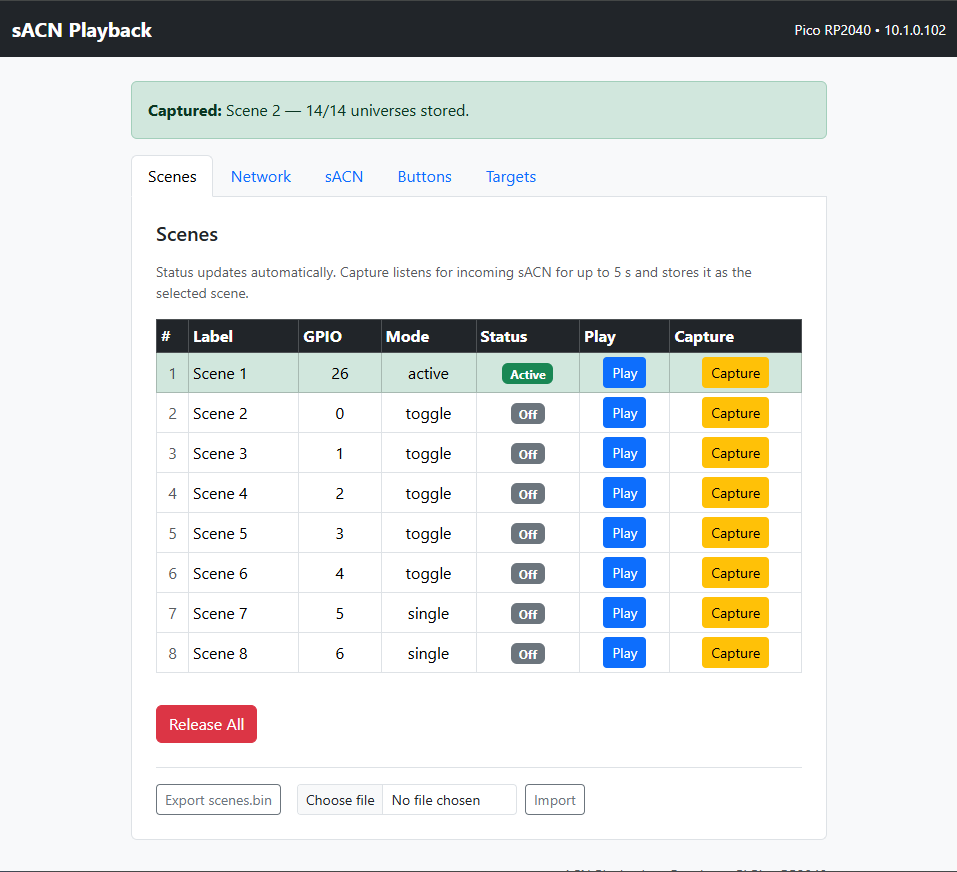
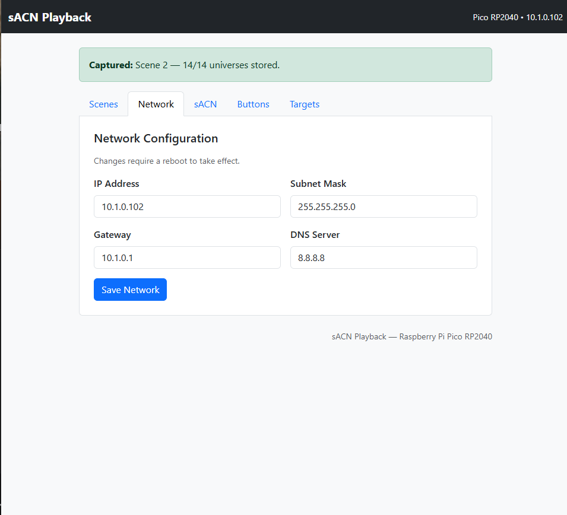
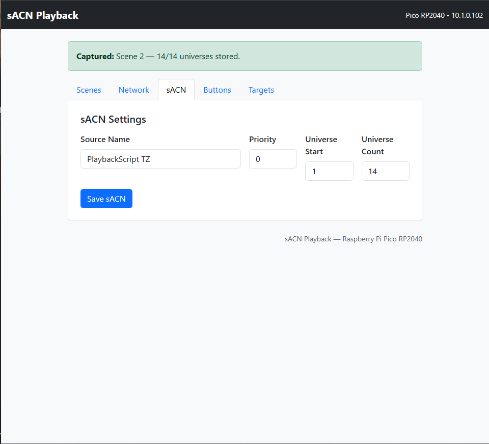
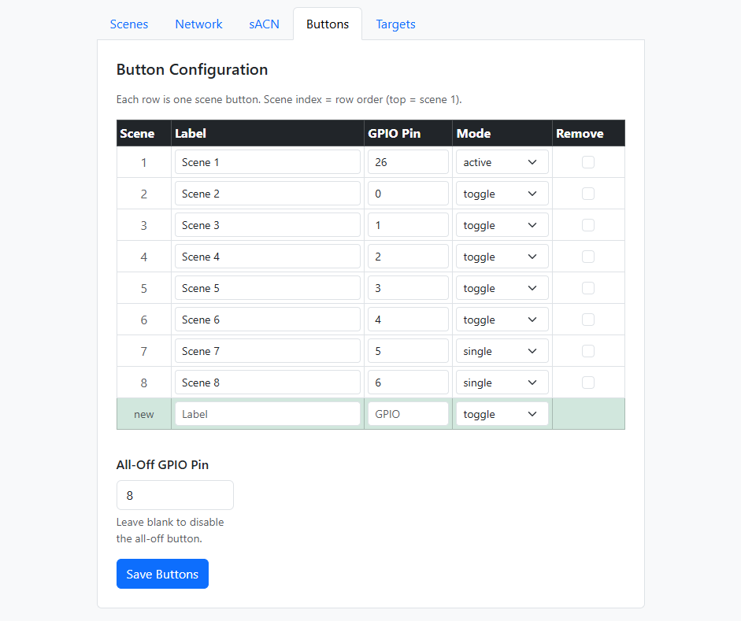
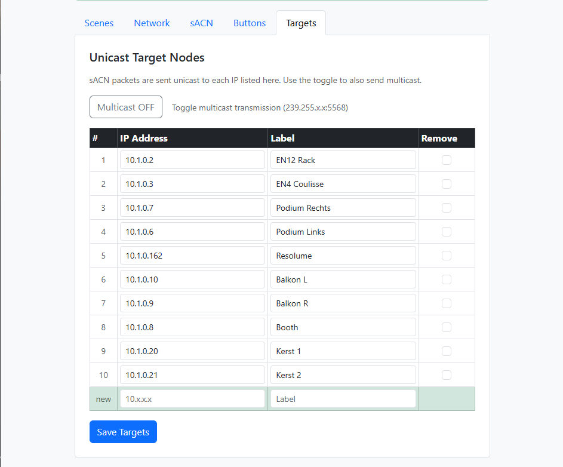

# sACN_PlaybackMachine

sACN_PlaybackMachine is a way to capture a single frame of multiple universes of DMX data over Streaming ACN (E1.31) 

The playback machine comes with a webserver for configuration of network, sACN, and GPIO.
It also features a control interface to capture and play scenes for testing.

## Hardware

This project was built on [WIZnets W5500-EVB-Pico](https://wiznet.io/products/evaluation-boards/w5500-evb-pico) The firmware file containing the build with the w5500 driver is added in the repository.

## Web UI

Control active scenes, capture them or import export the scene file

Configure network settings

Configure Source name and Streaming ACN settings

Configure GPIO, labeling, and modes 
Toggle =  toggle switch, push on, push off 
Active = Plays a scene while pressed 
Single =  single shot when pressed 

Configure unicast targets or enable/disable multicast